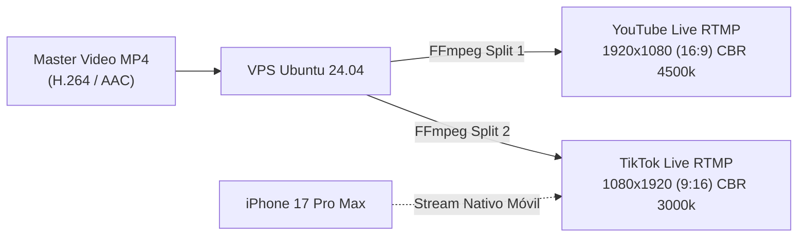

# 🛠️ Stack Tecnológico, Hardware y Herramientas

Este documento detalla la especificación técnica de cada componente de la infraestructura: la flotilla de hardware físico local, los servidores en la nube, las herramientas de software y los modelos de inteligencia artificial empleados en la producción y transmisión continua 24/7.

---

## 💻 1. Matriz de la Flotilla de Hardware Local

| Dispositivo | Especificaciones Técnicas | Rol Primario | Rol Secundario / Contingencia | Software Esencial |
| :--- | :--- | :--- | :--- | :--- |
| **MacBook Pro 13" (2020)** | • Apple Silicon M1 (8 cores CPU / 8 cores GPU)<br>• 8 GB RAM Unificada<br>• 256 GB SSD NVMe | **Motor de Renderizado & Composición Visual:** Ensamble de secuencias de video de alta duración (4-8 hrs) aprovechando aceleración por hardware con Apple VideoToolbox / Metal. | Generación de prompts de video, escalado AI y composición multicapa. | • CapCut Desktop Pro<br>• DaVinci Resolve 19<br>• Topaz Video AI<br>• Python 3.12 (Pillow, MoviePy) |
| **iMac 2015 27"** | • Intel Core i5/i7 x64<br>• **24 GB RAM DDR3**<br>• 1 TB HDD Fusion Drive<br>• macOS Monterey | **Estación de Audio & Hub de Automatización:** Por su abundante memoria RAM, procesa bibliotecas masivas de audio sin cuellos de botella. Generación de frecuencias binaurales, normalización a -14 LUFS e inyección de metadatos. | Servidor local de automatización (n8n), almacenamiento masivo intermedio de pistas e ingesta de B-Roll. | • Audacity / Reaper<br>• SoX (Sound eXchange)<br>• FFmpeg (Batch processing)<br>• n8n Desktop / Docker<br>• Google Drive Client |
| **Dell Windows x64 #1** | • Intel Core x64<br>• 8 GB RAM<br>• 512 GB HDD<br>• Pantalla 24" 2K Widescreen | **Nodo de Staging & OBS de Contingencia:** Mantiene escenas idénticas a las del VPS listas para transmitir. Si el VPS requiere mantenimiento, este nodo toma la emisión sin que el canal se desconecte. | Pruebas de bitrate, simulación de cortes de red y renderizado secundario en CPU. | • OBS Studio (v30+)<br>• VLC Media Player<br>• Streamlink<br>• NGINX RTMP local |
| **Dell Windows x64 #2** | • Intel Core x64<br>• 8 GB RAM<br>• 512 GB HDD<br>• Pantalla 24" 2K Widescreen | **Centro de Control, SEO & Moderación:** Monitoreo analítico en tiempo real del YouTube Studio y TikTok Live Center. Optimización de metadatos, tags A/B testing y moderación automática de chat. | Creación gráfica de miniaturas, portadas de directos y banners de canal. | • Google Chrome (Perfiles de canal)<br>• TubeBuddy / VidIQ<br>• Adobe Photoshop / Canva<br>• Nightbot / StreamElements |
| **iPhone 17 Pro Max** | • Apple A19 Pro<br>• **1 TB Almacenamiento**<br>• Sistema de Cámaras 48MP ProRes / Log | **Captura de Huella Creativa Original (Creative Fingerprint):** Grabación en 4K 60fps de texturas reales (lluvia, fuego de chimeneas, velas en santuarios, naturaleza). **Elimina el riesgo de baneo por contenido reutilizado**. | Transmisión vertical directa hacia TikTok Live (9:16) mediante TikTok Live Studio o app oficial. | • Blackmagic Camera App<br>• Filmic Pro<br>• YouTube Studio Mobile<br>• TikTok App |
| **Xiaomi Redmi Note 8** | • Snapdragon 665<br>• 4 GB RAM<br>• 64 GB interno + **128 GB MicroSD** | **Centinela 24/7 (Always-On Telemetry):** Montado en dock permanente con alimentación constante. Actúa como monitor físico de salud del stream, alertas de bitrate y verificación de latencia. | Teléfono de backup para autenticación de dos factores (2FA) y notificaciones de emergencia vía Telegram bot. | • YouTube Studio App<br>• Twitch / TikTok Monitor<br>• PingTools Network Utilities<br>• Telegram Notifier |

---

## ☁️ 2. Infraestructura Cloud (VPS de Emisión Continua)

Para no someter los ordenadores de casa a desgaste térmico continuo (24 horas al día, 365 días al año) ni arriesgar la transmisión ante cortes de luz o de fibra doméstica, se utiliza un VPS dedicado en la nube:

### Especificaciones del Servidor:
- **Proveedor sugerido:** Hetzner Cloud (Instancia `CPX21` x86 con 3 vCPU / 4 GB RAM / 80 GB NVMe a ~€7/mes) o `CAX21` (Ampere ARM 4 vCPU / 8 GB RAM a ~€6/mes).
- **Alternativas:** DigitalOcean Droplet ($6 a $12/mes) o Linode/Akamai.
- **Sistema Operativo:** Ubuntu 24.04 LTS (Noble Numbat).
- **Ancho de banda:** Conexión simétrica de 1 Gbps a 10 Gbps con tráfico de 20 TB mensuales incluidos (suficiente para emitir a 4500 kbps de forma ininterrumpida).

### Software Base en VPS:
```bash
# Paquetes esenciales
sudo apt update && sudo apt install -y \
    ffmpeg \
    tmux \
    htop \
    curl \
    git \
    rsync \
    speedtest-cli \
    ufw
```

---

## 🧠 3. Modelos de Inteligencia Artificial en Producción

El ecosistema aprovecha modelos de IA especializados para cada capa del contenido, garantizando máxima calidad y derechos comerciales:

### A. Generación Musical & Audio Base
- **Suno AI (v3.5 / v4) [Plan Pro/Premier]:** Composición de bases melódicas instrumentales de piano etéreo, lofi chillhop, coros sacros y pads atmosféricos con licencia comercial absoluta.
- **Udio AI (v1.5) [Plan Standard/Pro]:** Creación de paisajes sonoros complejos, cuencos tibetanos y texturas acústicas orgánicas de larga duración.
- **Motor Matemático Python (NumPy/SciPy) & SoX:** Inyección precisa de ondas senoidales puras en frecuencias Solfeggio (432 Hz, 528 Hz, 639 Hz) y tonos isocrónicos / binaurales (Alfa 10 Hz, Theta 6 Hz, Delta 2 Hz).

### B. Voz en Off & Oración Guiada
- **ElevenLabs (Modelo Multilingual v2 / Flash):**
  - Clonación de voces institucionales cálidas, pausadas y reflexivas (estilo devocional, narración literaria o meditación zen).
  - Tasa de muestreo de 44.1 kHz / 128-192 kbps sin artefactos metálicos.
  - Generación en lotes mediante scripts de Python utilizando la API oficial de ElevenLabs.

### C. Generación Visual & B-Roll Sintético
- **Midjourney v6.1 / Flux.1 Schnell:**
  - Generación de fotogramas clave en proporción 16:9 (1920x1080) y 9:16 (1080x1920).
  - Estilos visuales: iluminación volumétrica, cinemática de alta atmósfera, vidrieras iluminadas, lluvia en ventanales modernos, bibliotecas cálidas y paisajes naturales de amanecer.
- **Kling AI / Runway Gen-3 Alpha / Luma Dream Machine:**
  - Animación sutil de los fotogramas (micro-movimientos de cámara, humo de chimenea, agua corriendo, hojas mecidas por el viento).
- **Topaz Video AI:**
  - Escalado y reconstrucción a 4K 60fps con eliminación de artefactos de compresión.

---

## 📡 4. Pipeline de Multi-Streaming (YouTube + TikTok)

La emisión simultánea se aborda mediante dos estrategias complementarias:



1. **Split en Servidor Cloud:**
   - Un solo comando FFmpeg en el VPS lee el archivo maestro una sola vez en memoria y lo envía en paralelo a dos servidores RTMP distintos (YouTube y TikTok), realizando un recorte/crop central a 9:16 para TikTok si se desea transmitir el mismo bucle.
2. **Emisión Dual Híbrida (Recomendada):**
   - El VPS sostiene la transmisión 24/7 de YouTube con audio de altísima fidelidad y visuales 16:9 relajantes.
   - El iPhone 17 Pro Max se utiliza para hacer sesiones en vivo de TikTok Live de 1 a 2 horas diarias interactuando con la audiencia móvil en formato vertical nativo.
