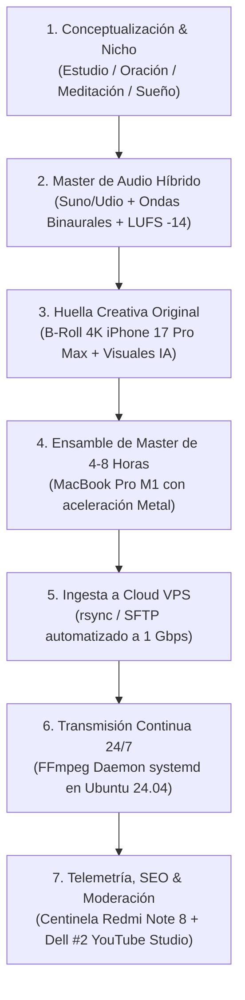

# 📐 Metodología de Producción y Arquitectura del Sistema

Este documento describe la metodología de trabajo extremo a extremo para la creación de contenido, las reglas maestras de blindaje contra las políticas de monetización de YouTube (evitar el rechazo por "contenido reutilizado") y los protocolos de tolerancia a fallos.

---

## 🔄 1. Ciclo de Producción en 7 Pasos

### Paso 1: Selección de Nicho y Guionización
- Se define la intención de búsqueda principal (Search Intent). La gente no busca nombres de artistas independientes; busca soluciones a estados de ánimo o necesidades:
  - *Oración:* "Oración de la noche para dormir en paz", "Salmo 91 con música celestial", "Rosario guiado 432 Hz".
  - *Estudio:* "Música Lofi para estudiar y programar", "Ruido Marrón para TDAH y concentración profunda".
  - *Sueño:* "Lluvia sobre techo de lámina 8 horas", "Frecuencia Delta para insomnio severo".
- Si el nicho incluye voz (oraciones o meditaciones), los guiones se redactan con una estructura narrativa de tres actos: Conexión emocional inicial, profundización reflexiva y cierre con bendición/paz.

### Paso 2: Producción del Master de Audio Híbrido (iMac 2015)
- Se compone una pista musical base con Suno v3.5/v4 o Udio Pro (licencia comercial).
- En el iMac 2015 (con sus 24 GB de RAM), se importa la pista a Audacity o se procesa con SoX.
- Se inyecta la **frecuencia pura matemática**:
  - Para oración/devoción: Frecuencia 432 Hz (afinación de Verdi) o 528 Hz (frecuencia milagrosa de transformación).
  - Para estudio: Tono isocrónico o binaural a 10 Hz (onda Alfa) sobre una base de 200 Hz.
  - Para sueño: Onda Delta a 2 Hz sobre ruido rosa suave.
- Si lleva locución, se sintetiza la voz en ElevenLabs y se mezcla a -3 dB por encima de la música.
- Se normaliza el master final a **-14 LUFS integrados** (estándar nativo de YouTube para evitar atenuación automática) con un True Peak de **-1.0 dBTP**.

### Paso 3: Huella Creativa Original (iPhone 17 Pro Max)
- **Eliminación del riesgo de rechazo:** Con el iPhone 17 Pro Max en 4K ProRes se graban clips propios de 30 a 60 segundos de:
  - Gotas de lluvia resbalando en ventanas iluminadas.
  - Fuego real en chimenea o velas parpadeando en penumbra.
  - Hojas de plantas o paisajes locales al atardecer.
- Estos clips se combinan con fondos generados por Midjourney v6 y animados sutilmente en Kling AI o Runway Gen-3.

### Paso 4: Ensamble del Master de 4 a 8 Horas (MacBook Pro M1)
- El M1 procesa la línea de tiempo en CapCut Desktop o DaVinci Resolve.
- Se colocan capas de variación dinámica:
  - Capa 1: Fondo visual animado con respiración de cámara lenta (parallax zoom).
  - Capa 2: B-roll real del iPhone en modos de fusión (Screen / Soft Light) para aportar textura analógica real.
  - Capa 3: Temporizador discreto o versículos/citas que rotan cada 10 a 15 minutos (esto le demuestra al revisor humano de YouTube que el video evoluciona con el tiempo).
  - Capa 4: Partículas flotantes de luz o lluvia en primer plano.
- Exportación: Contenedor MP4, códec H.264 (mediante Apple VideoToolbox para renderizar a máxima velocidad sin sobrecalentar el chip), 1920x1080 a 30 fps, bitrate constante (CBR) de 4500 kbps, audio AAC estéreo a 160 kbps 44.1 kHz, keyframe cada 60 cuadros (2 segundos exactos).

### Paso 5: Ingesta al Servidor Cloud (VPS)
- Mediante un script `rsync` o SFTP, el master de video se transfiere directamente al directorio `/home/stream/media/` del VPS.
- Gracias a la conexión simétrica del VPS, la subida toma pocos minutos y el archivo queda residente en el disco NVMe del servidor.

### Paso 6: Transmisión Continua 24/7 con FFmpeg
- El servidor ejecuta un demonio de `systemd` que llama a FFmpeg en bucle infinito (`-stream_loop -1`).
- Dado que el archivo ya fue renderizado con los parámetros estrictos de YouTube (`x264` + `aac`), el VPS puede hacer la transmisión usando `-c:v copy -c:a copy`, consumiendo **menos del 3% de CPU**.

### Paso 7: Telemetría, Centinela y Moderación
- El Xiaomi Redmi Note 8 en dock muestra el estado del directo en YouTube Studio Mobile.
- Dell Windows #2 monitorea el chat en vivo, fija mensajes anclados con enlaces a productos digitales o comunidades, y ajusta etiquetas según las tendencias de búsqueda.

---

## 🛡️ 2. Blindaje Contra Desmonetización y Políticas de YouTube (YPP 2026)

> [!CAUTION]
> **Motivo #1 de rechazo de monetización en canales de música y relajación:**
> YouTube clasifica automáticamente como *"Contenido Reutilizado o Repetitivo"* aquellos directos que consisten en una sola imagen fija con música descargada de librerías libres de derechos.

### Las 3 Reglas de Oro de Aprobación:

| Regla | Riesgo Tradicional | Solución Implementada en Nuestro Pipeline |
| :--- | :--- | :--- |
| **1. Huella Creativa Original (Creative Fingerprint)** | Descargar videos de Pexels/Pixabay que ya usan 5,000 canales. | Inclusión de clips propios grabados con el iPhone 17 Pro Max en 4K ProRes. YouTube detecta metadatos y texturas que no existen en ningún otro video del mundo. |
| **2. Dinámica Multicapa Visual** | Una imagen estática o un loop de 5 segundos repetido. | Composición multicapa con textos cambiantes (versículos, consejos, reflexiones cada 10 min), partículas en movimiento, reloj/temporizador y transiciones suaves cada 30-45 minutos. |
| **3. Pistas de Audio Híbridas Propias** | Pistas genéricas reclamadas por agregadoras mediante Content ID. | Melodías exclusivas de Suno/Udio combinadas con frecuencias matemáticas puras generadas con Python/SoX. Espectro acústico único no detectable por Content ID ajeno. |

---

## 🚨 3. Tolerancia a Fallos y Redundancia (High Availability)

El sistema está diseñado para que la transmisión **nunca se caiga**, sin importar qué ocurra en el mundo físico:

1. **Corte de luz o internet en casa:**
   - La flotilla local puede estar completamente apagada o sin internet. El VPS en la nube sigue transmitiendo a YouTube sin la más mínima fluctuación de bitrate.
2. **Reinicio o caída del proceso FFmpeg en el VPS:**
   - El servicio `livestream.service` configurado en `systemd` tiene la directiva `Restart=always` con `RestartSec=5`. Si el proceso muere por cualquier causa, el sistema operativo lo relanza en 5 segundos. YouTube mantiene el búfer abierto durante 30 a 60 segundos, por lo que los espectadores no notan ninguna desconexión.
3. **Mantenimiento programado del VPS:**
   - Si el VPS requiere actualización de kernel o reinicio de hardware, se activa el nodo de contingencia **Dell Windows #1 con OBS Studio**. Se inicia la transmisión local con la misma clave de streaming; YouTube absorbe la señal inmediatamente sin cortar el directo. Una vez finalizado el mantenimiento, el VPS retoma el stream y Dell #1 se desconecta.
