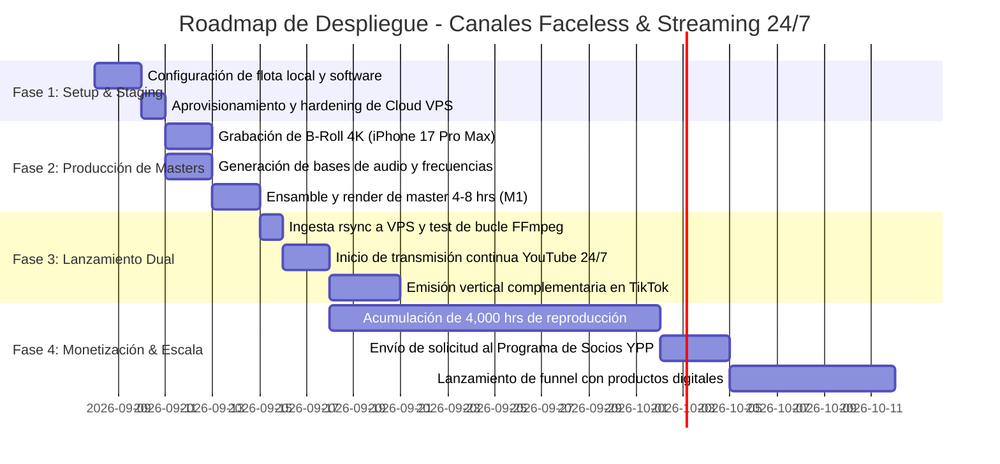

# 📅 Calendarización, Roadmap y Operación Semanal

Este documento establece el plan de despliegue estratégico dividido en cuatro fases secuenciales, junto con el calendario operativo semanal para la renovación continua de contenidos y mantenimiento del sistema.

---

## 🗺️ 1. Roadmap de Despliegue en 4 Fases

---

### Fase 1: Acondicionamiento de Hardware y Staging Cloud (Días 1 a 3)
- **Local:**
  - Instalar y verificar OBS Studio en Dell Windows #1 con perfil configurado a 1920x1080 30fps CBR 4500k.
  - Configurar Audacity y herramientas SoX en iMac 2015 para procesamiento por lotes.
  - Configurar perfil de Chrome en Dell Windows #2 para YouTube Studio y herramientas de SEO (TubeBuddy / VidIQ).
  - Instalar Blackmagic Camera en iPhone 17 Pro Max configurando códec Apple ProRes 422 a 4K 30fps.
  - Instalar dock permanente con cargador para Xiaomi Redmi Note 8 como centinela.
- **Nube:**
  - Crear servidor Ubuntu 24.04 LTS en Hetzner Cloud (`CPX21` o `CAX21`).
  - Configurar SSH seguro con llaves Ed25519 y firewall UFW (abrir únicamente puertos 22 SSH y 1935 RTMP si aplica).
  - Instalar FFmpeg, tmux, htop y configurar el servicio `livestream.service`.

### Fase 2: Banco de Medios y Creación de Masters (Días 4 a 7)
- **Producción Sonora:**
  - Generar 10 a 15 pistas base en Suno v3.5/Udio para el primer nicho (ej. Oración Devocional o Música para Estudiar).
  - Generar con Python/SoX ondas binaurales (Alfa 10 Hz o Solfeggio 432 Hz).
  - Mezclar pistas en iMac 2015, aplicar ecualización y normalizar a -14 LUFS.
- **Captura Visual:**
  - Grabar 20 clips de B-roll original de texturas (lluvia, fuego, velas, hojas) con el iPhone 17 Pro Max.
  - Generar fondos hiperrealistas en Midjourney v6 y animarlos en Kling AI.
- **Ensamble Final:**
  - Montar en CapCut Desktop o DaVinci Resolve en el MacBook Pro M1 un video de 4 a 6 horas con capas dinámicas.
  - Exportar con aceleración por hardware Apple VideoToolbox (H.264, 4500 kbps, keyframe 2s).

### Fase 3: Lanzamiento de la Transmisión Dual (Días 8 a 10)
- Transferir el master al VPS vía `rsync` con compresión activada.
- Obtener la clave de transmisión permanente en YouTube Live Dashboard.
- Iniciar el servicio `systemctl start livestream` y validar telemetría de emisión (bitrate constante, cero cuadros perdidos).
- Realizar pruebas de conmutación apagando el VPS temporalmente para verificar la toma de control desde Dell Windows #1.
- Iniciar directos verticales sincronizados en TikTok Live mediante TikTok Live Studio o app móvil.

### Fase 4: Aceleración de Retención y Monetización YPP (Días 11 a 30)
- Monitorear diariamente el crecimiento de horas de reproducción en YouTube Analytics.
- Con 20 a 30 espectadores concurrentes sostenidos, alcanzar las 4,000 horas requeridas en menos de 10 días.
- Aplicar a la monetización del YouTube Partner Program (YPP).
- Habilitar Super Chats, Super Stickers y membresías de canal.
- Anclar mensaje en el chat del directo hacia el catálogo de productos digitales en Gumroad / Lemon Squeezy (packs de audio en WAV sin compresión, guías devocionales, plantillas de meditación).

---

## ⏰ 2. Calendario Operativo Semanal

Para mantener el canal fresco y con alta retención algorítmica sin requerir dedicación excesiva de tiempo humano, se sigue la siguiente rutina semanal:

| Día | Tarea Primaria | Equipo Responsable | Tiempo Estimado |
| :--- | :--- | :--- | :--- |
| **Lunes** | **Curaduría & Audio:** Generación de nuevas pistas en Suno/Udio e inyección de frecuencias Solfeggio / Binaurales. | iMac 2015 | 45 min |
| **Martes** | **Captura & B-Roll:** Sesión de 15 minutos grabando B-roll con iPhone y renderizado de clips IA en Midjourney/Kling. | iPhone 17 Pro Max | 30 min |
| **Miércoles** | **Ensamble & Render:** Montaje del nuevo bloque de 4 horas y exportación acelerada en M1. Subida rsync a VPS. | MacBook Pro M1 | 60 min (background) |
| **Jueves** | **SEO, Thumbnails & Analítica:** A/B test de miniaturas en Dell #2, ajuste de títulos y revisión de retención por hora. | Dell Windows #2 | 30 min |
| **Viernes** | **Live Vertical en TikTok:** Sesión en vivo de 1 hora en TikTok Live desde el iPhone para dirigir tráfico a YouTube. | iPhone 17 Pro Max | 60 min |
| **Sábado** | **Verificación del Centinela:** Chequeo visual de latencia, espacio en disco del VPS y limpieza de logs antiguos. | Redmi Note 8 + VPS | 15 min |
| **Domingo** | **Descanso Operativo:** El sistema corre en piloto automático al 100% en la nube. | Cloud VPS | 0 min |
