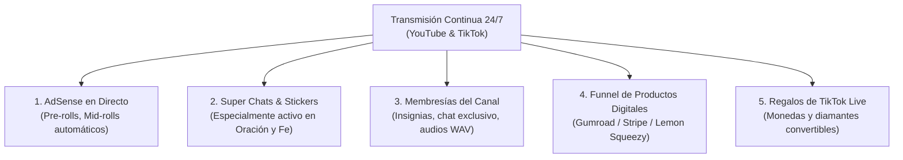

# 📈 Proyecciones Matemáticas, Watch Time y Monetización

Este documento desglosa las proyecciones cuantitativas de tiempo de reproducción (Watch Time), los tiempos estimados para acceder al Programa de Socios de YouTube (YPP) y las cinco fuentes de ingresos que componen el modelo financiero del proyecto.

---

## ⏱️ 1. Matemática de Watch Time (El Poder del Streaming 24/7)

Para monetizar en YouTube se requieren:
- **1,000 suscriptores.**
- **4,000 horas de reproducción públicas válidas** en los últimos 365 días.

En los canales tradicionales de videos cortos (5 a 10 minutos), alcanzar 4,000 horas exige entre 40,000 y 80,000 reproducciones completas. En cambio, en una transmisión continua 24/7, la acumulación de horas es exponencial:

$$\text{Horas Diarias} = \text{Espectadores Concurrentes Promedio (CCV)} \times 24 \text{ horas}$$

### Tabla de Proyección de Horas y Días para Monetizar:

| Espectadores Concurrentes Promedio (CCV) | Horas de Reproducción por Día | Días para Alcanzar 4,000 Horas | Horas Mensuales Acumuladas |
| :---: | :---: | :---: | :---: |
| **5 CCV** (Fase de arranque inicial) | 120 horas / día | **33.3 días** | 3,600 hrs / mes |
| **10 CCV** (Primeras recomendaciones algorítmicas) | 240 horas / día | **16.6 días** | 7,200 hrs / mes |
| **20 CCV** (Nivel estándar de estabilidad) | 480 horas / día | **8.3 días** | 14,400 hrs / mes |
| **50 CCV** (Canal posicionado en búsquedas clave) | 1,200 horas / día | **3.3 días** | 36,000 hrs / mes |
| **100 CCV** (Canal consolidado en nicho) | 2,400 horas / día | **1.6 días** | 72,000 hrs / mes |

> [!TIP]
> Incluso con una audiencia modesta de solo **20 personas conectadas simultáneamente** escuchando música para estudiar o descansar, el canal alcanza las 4,000 horas en **menos de 9 días**.

---

## 💰 2. Las 5 Fuentes de Monetización

### 1. YouTube AdSense (RPM $2.00 a $5.00 USD)
- YouTube inserta anuncios pre-roll (al entrar a la transmisión) y mid-rolls periódicos configurados cada 30 o 45 minutos.
- Dado que los usuarios permanecen conectados entre 45 minutos y 4 horas consecutivas (mientras duermen o estudian), la cantidad de impresiones por usuario es sumamente elevada.
- RPM estimado en nichos de relajación/espiritualidad con audiencia de México, EE.UU. y España: **$2.50 a $4.50 USD** por cada 1,000 vistas.

### 2. Super Chats & Super Stickers (Donaciones en Vivo)
- En nichos de oración, espiritualidad y devoción sacra, los espectadores tienen una altísima propensión a enviar donaciones directas acompañadas de peticiones de salud, familia o agradecimiento comunitario.
- El chat se convierte en un punto de encuentro espiritual activo las 24 horas del día.

### 3. Membresías del Canal (Suscripciones Recurrentes)
- Niveles sugeridos:
  - **Nivel 1 ($1.99 USD/mes):** Insignias de lealtad en el chat y emojis personalizados.
  - **Nivel 2 ($4.99 USD/mes):** Acceso a directos exclusivos de oración guiada o sesiones de concentración sin ningún anuncio.
  - **Nivel 3 ($9.99 USD/mes):** Enlace directo para descargar todas las pistas en calidad WAV de estudio (24-bit 96kHz) sin compresión.

### 4. Embudo de Productos Digitales (El Mayor Margen de Ganancia)
- Mediante un **mensaje fijado permanentemente en el chat** y en la descripción del video:
  - *Pack de Audios WAV de 8 Horas sin compresión* ($9 a $19 USD).
  - *Cuaderno / Diario de Gratitud y Oración en PDF imprimible* ($7 a $12 USD).
  - *Kit de Sonidos Ambientales con Frecuencias Solfeggio para Productividad* ($15 USD).
- Conversión típica de 0.5% a 1.5% de los visitantes diarios hacia el enlace del producto digital.

### 5. Regalos en TikTok Live (TikTok Diamonds)
- Las emisiones verticales en TikTok Live permiten recibir regalos virtuales (rosas, galaxias, coronas) que TikTok convierte en saldo retirable por PayPal o transferencia bancaria.
- Además, TikTok es la mejor fuente de tráfico orgánico gratuito para canalizar usuarios hacia el canal de YouTube.

---

## 📊 3. Proyección de Ingresos Trimestral (Estimación Conservadora)

| Concepto de Ingreso | Mes 1 (Lanzamiento) | Mes 2 (Monetización Activa) | Mes 3 (Escalamiento) |
| :--- | :---: | :---: | :---: |
| **YouTube AdSense** | $0 USD (en aprobación) | $250 - $450 USD | $600 - $1,200 USD |
| **Super Chats & Donaciones** | $0 USD | $100 - $250 USD | $300 - $600 USD |
| **Membresías de Canal** | $0 USD | $50 - $150 USD | $200 - $500 USD |
| **Venta de Productos Digitales** | $100 - $250 USD | $350 - $800 USD | $800 - $1,800 USD |
| **Regalos de TikTok Live** | $50 - $100 USD | $100 - $200 USD | $250 - $500 USD |
| **Total Estimado Mensual** | **$150 - $350 USD** | **$850 - $1,850 USD** | **$2,150 - $4,600 USD** |
| **Costo Operativo Cloud (VPS)** | -$8 USD | -$8 USD | -$16 USD (2 streams) |
| **Margen Operativo Neto** | **> 95%** | **> 98%** | **> 99%** |
