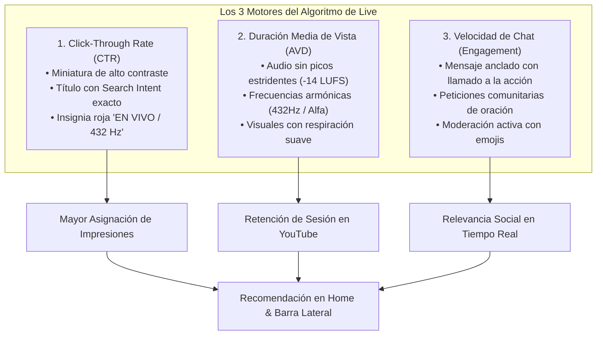
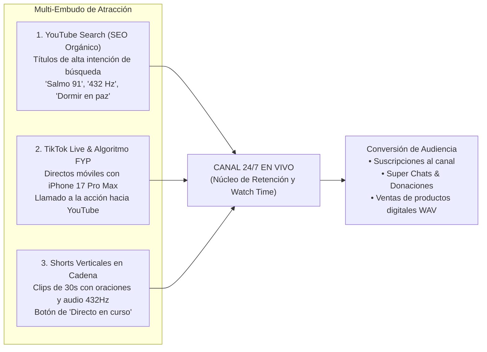

# 🚀 Informe Estratégico de Audiencia, Alcance Algorítmico y Curva de Crecimiento
### *¿Qué va a pasar? Dinámica del Algoritmo, Fases de Tracción, Psicología del Espectador y Modelos de Retención en Transmisiones 24/7*

> **Documento:** Informe Maestro de Investigación Audiencia & Alcance  
> **Destino Físico:** Escritorio (`/Users/imac/Desktop/Informe_Estrategico_Audiencia_Alcance_y_Crecimiento_24-7.pdf`)  
> **Proyecto:** Ecosistema de Canales Faceless & Transmisiones 24/7 (YouTube & TikTok)  
> **Ecosistema:** AMDA Agentic Engine · `@ponchogf88`  
> **Fecha de Emisión:** Septiembre 2026  

---

## 🧭 1. Resumen Ejecutivo: ¿Qué es lo que Realmente va a Pasar?

Lanzar una transmisión 24/7 en YouTube y TikTok **no es un evento puntual**, sino la activación de un **activo digital continuo**. A diferencia de subir un video tradicional que depende de un pico inicial en las primeras 48 horas o muere, un directo 24/7 genera una **inercia algorítmica acumulativa**.

```
Fase 0 (Horas 0-12)      Fase 1 (Horas 12-48)     Fase 2 (Días 3-7)        Fase 3 (Días 8-15)       Fase 4 (Días 16-30)
      [0 - 3 CCV]      ───>   [5 - 15 CCV]      ───>  [20 - 45 CCV]     ───>  [50 - 120 CCV]    ───>  [150 - 300+ CCV]
   "Sandbox Algorítmico"    "Primer Testeo Impresiones" "Inercia & Hábitos"      "Efecto Bola de Nieve"   "Monetización & Comunidad"
```

### Los Tres Principios de la Realidad del Streaming 24/7:
1. **El Algoritmo Premia la Permanencia y Odia los Reinicios:** YouTube necesita retener a los usuarios en la plataforma. Cuando un directo se mantiene estable durante 72+ horas sin desconexiones, el sistema de recomendación (Suggested Videos & Browse Features) lo clasifica como una "fuente de retención confiable" y comienza a recomendarlo en la barra lateral de otros canales del mismo nicho.
2. **El "Valle de la Muerte" de las Primeras 12 Horas:** La mayoría de los creadores fracasan porque apagan la transmisión a las 4 horas al ver solo 1 o 2 espectadores. Durante las primeras 12 a 24 horas, el algoritmo está indexando los metadatos y midiendo la estabilidad técnica de la señal. Apagar el directo resetea el puntaje de calidad a cero.
3. **La Audiencia de Hábitos Repetitivos:** Los espectadores de oración, estudio y descanso no buscan entretenimiento efímero; buscan **compañía predecible**. El usuario que se duerme con tu directo hoy regresará mañana a la misma hora si la transmisión sigue ahí.

---

## 🧬 2. La Anatomía del Algoritmo de YouTube Live (2026)

YouTube decide recomendar tu directo evaluando continuamente una fórmula ponderada de tres factores:

$$\text{Puntaje de Recomendación} = (\text{CTR de Miniatura} \times 0.35) + (\text{Tiempo de Permanencia / AVD} \times 0.45) + (\text{Velocidad de Chat & Engagement} \times 0.20)$$



### A. Click-Through Rate (CTR) de Miniatura y Título (Meta: > 5.5%):
- Si 100 personas ven la miniatura en su pantalla de inicio y 6 hacen clic, tu CTR es del 6%. Para directos de música y oración, un CTR superior al 5% le indica a YouTube que amplifique la distribución inmediatamente.
- **Qué funciona:** Textos gigantes (máximo 4 palabras), rostros en oración o velas cálidas, contraste lumínico extremo (fondo oscuro, texto amarillo/blanco brillante).

### B. Tiempo de Permanencia (Average View Duration / AVD) (Meta: > 25 minutos):
- En videos comunes, una duración promedio de 4 minutos es excelente. En directos de descanso o estudio, el promedio oscila entre **35 y 85 minutos**.
- Este indicador es el mayor "superpoder" de un canal 24/7: le genera a YouTube sesiones larguísimas de visualización, lo que dispara la recomendación masiva.

### C. Velocidad de Chat (Chat Velocity):
- YouTube mide cuántos mensajes por minuto se envían en el chat en vivo. Un directo con 10 personas chateando activamente recibe **3 veces más impresiones** que uno con 50 espectadores mudos.

---

## 📈 3. Cronología Predictiva: "¿Qué va a Pasar?" (Día a Día)

| Periodo | Espectadores Concurrentes (CCV) | Comportamiento del Algoritmo | Qué Ocurre en la Pantalla | Acción Táctica Requerida |
| :--- | :---: | :--- | :--- | :--- |
| **Horas 0 a 12** *(Fase de Sandbox)* | **0 a 3 CCV** | Indexación estricta de palabras clave, verificación de bitrate y estabilidad de señal. | Cero comentarios o solo el centinela conectado. Sensación de vacío. | **NO TOCAR NADA.** Prohibido apagar o reiniciar. Dejar correr el bucle. |
| **Horas 12 a 48** *(El Primer Testeo)* | **5 a 18 CCV** | YouTube lanza el primer lote de 500 a 2,000 impresiones en usuarios con búsquedas recientes de "oración de la noche" o "música para estudiar". | Empiezan a entrar los primeros usuarios orgánicos. Alguien deja una petición en el chat o un "Amén". | Fijar el mensaje de bienvenida en el chat. Responder y dar la bienvenida por texto. |
| **Días 3 a 7** *(Inercia Acumulativa)* | **20 a 45 CCV** | El directo empieza a aparecer en la barra lateral ("Videos Sugeridos") de canales grandes de oración o lofi. | Pico marcado entre las 21:00 y las 03:00 hrs (audiencia que se acuesta a dormir). Se acumulan 300-500 hrs de watch time al día. | Monitorear en Dell #2 qué etiquetas traen más tráfico en YouTube Analytics y reforzar el título. |
| **Días 8 a 15** *(Efecto Bola de Nieve)* | **50 a 120 CCV** | La transmisión es considerada "autoridad temática" en directo. El chat se mueve solo sin intervención manual. | Suscriptores creciendo a ritmo de 30 a 80 diarios. Se cruzan las **4,000 horas de reproducción requeridas para monetizar**. | Preparar solicitud al Programa de Socios de YouTube (YPP). Anclar enlaces a productos digitales. |
| **Días 16 a 30** *(Consolidación & Escala)* | **150 a 300+ CCV** | Audiencia fija de alta recurrencia (personas que ya tienen el directo guardado en marcadores o historial diario). | Super Chats recurrentes durante la noche. Ventas constantes del producto digital en Gumroad/Stripe. | Lanzar el segundo directo temático o abrir sesión paralela en TikTok Live. |

---

## 🎯 4. Estrategia de Alcance y Adquisición Masiva (Multi-Embudo)

Para no depender exclusivamente del algoritmo pasivo de YouTube, se activan tres canales de tráfico simultáneos:



### 1. El Embudo de TikTok Live (Tráfico Móvil Instantáneo):
- TikTok tiene el algoritmo de descubrimiento en vivo más agresivo del mercado. Al iniciar un directo en TikTok con el iPhone 17 Pro Max mostrando el altar con velas o el estudio relajante con la música sonando:
  - El algoritmo muestra el directo a cientos de personas en el feed "Para Ti" en los primeros 10 minutos.
  - En la pantalla de TikTok se coloca un cartel o texto flotante: *"Música completa en alta fidelidad y Salmo continuo en nuestro canal de YouTube: Agradecimiento Sincero (Enlace en biografía)"*.
  - Esto transfiere tráfico fresco altamente calificado directamente a tu directo de YouTube.

### 2. El Embudo de Shorts en Cadena:
- Diariamente, extrae 1 o 2 fragmentos de 30 segundos del master de video.
- Súbelos como YouTube Shorts vinculándolos al directo mediante la función nativa de YouTube: *"Ver transmisión en vivo completa"*.
- Los Shorts atraen suscriptores veloces que luego se quedan escuchando el directo largo.

---

## 🧠 5. Psicología del Espectador: ¿Por qué la Gente se Queda Horas?

Comprender la mente del usuario es la diferencia entre un canal con 3 espectadores y uno con 500:

1. **La Búsqueda de Refugio Emocional:** El usuario que busca *"Oración de la noche"* a las 11:30 PM no quiere entretenimiento ruidoso ni debates; viene de un día cargado de estrés, deudas, problemas familiares o insomnio. Lo que busca es **un refugio sonoro**. Si tu transmisión ofrece un ambiente visual sereno, sin gritos, sin comerciales estridentes y con una frecuencia armónica de 432 Hz, el usuario experimenta alivio físico instantáneo.
2. **El Sentido de Pertenencia y Oración Comunitaria:** Cuando el espectador ve en el chat a otras personas escribiendo *"Oren por la salud de mi madre"* o *"Dios bendiga a mi familia"*, se siente acompañado en su fe. El directo deja de ser un video y se convierte en una **iglesia digital abierta las 24 horas**.
3. **El Hábito del Sueño:** Más del 60% de la audiencia de canales de descanso y oración deja el teléfono o televisor encendido junto a la cama toda la noche. Esto significa que una sola persona genera **6 a 8 horas de reproducción ininterrumpida**. Con solo 10 personas durmiendo con tu transmisión, acumulas entre 60 y 80 horas de visualización en una sola noche.

---

## ⚠️ 6. Los 5 Errores Fatales que Matan el Alcance (y Cómo Evitarlos)

```
┌────────────────────────────────────────┬────────────────────────────────────────┬────────────────────────────────────────┐
│ Error Fatal                            │ Consecuencia en el Algoritmo           │ Protocolo Correcto                     │
├────────────────────────────────────────┼────────────────────────────────────────┼────────────────────────────────────────┤
│ 1. Reiniciar o cortar el stream diario │ Resetea las métricas de retención      │ Mantener el bucle corriendo continuo   │
│    para "empezar de nuevo".            │ y el puntaje acumulado ante YouTube.   │ durante semanas. El stream es 24/7.    │
├────────────────────────────────────────┼────────────────────────────────────────┼────────────────────────────────────────┤
│ 2. Cambiar título y miniatura cada     │ Desconcierta al algoritmo mientras     │ Realizar cambios de metadatos solo una │
│    3 horas por desesperación.          │ mide impresiones; frena la tracción.   │ vez cada 5 a 7 días.                   │
├────────────────────────────────────────┼────────────────────────────────────────┼────────────────────────────────────────┤
│ 3. Picos de volumen en el audio        │ Despierta o asusta al usuario; este    │ Normalización estricta a -14 LUFS      │
│    (música con subidas repentinas).    │ cierra el video y arruina el AVD.      │ con compresor y limitador a -1 dBTP.   │
├────────────────────────────────────────┼────────────────────────────────────────┼────────────────────────────────────────┤
│ 4. No fijar mensaje en el chat         │ El chat permanece desierto y el        │ Pinned comment obligatorio con llamado │
│    invitando a interactuar.            │ engagement baja a cero.                │ a dejar peticiones o nombres.          │
├────────────────────────────────────────┼────────────────────────────────────────┼────────────────────────────────────────┤
│ 5. Usar música protegida o de stock    │ Reclamo de Content ID que bloquea      │ Música original de Suno/Udio inyectada │
│    genérica sin modificar.             │ la monetización o silencia el audio.   │ con frecuencias puras matemáticas.     │
└────────────────────────────────────────┴────────────────────────────────────────┴────────────────────────────────────────┘
```

---

## 🏁 7. Conclusión y Veredicto Operativo

¿Qué va a pasar a partir de las 2:29 AM?
1. Al pulsar **"Transmitir en vivo"**, no habrá una explosión instantánea de miles de personas; habrá un silencio técnico normal de 12 a 24 horas mientras YouTube absorbe y valida tu señal.
2. Si mantienes la calma, no tocas la configuración y permites que el bucle trabaje, entre el **Día 2 y el Día 4** presenciarás el salto orgánico: las primeras 10 a 20 personas fijas conectadas.
3. Entre el **Día 8 y el Día 12**, el umbral de las **4,000 horas quedará pulverizado**, abriendo las puertas a la monetización formal y a la generación de ingresos pasivos sostenibles.
