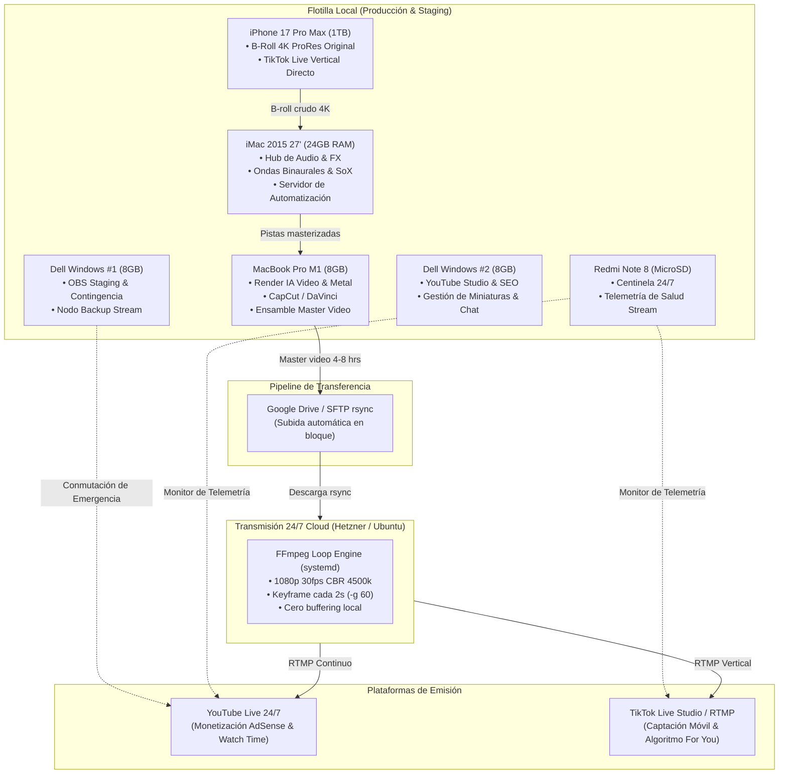

# 🎬 Canales Faceless & Transmisiones en Vivo 24/7 (YouTube & TikTok)
### *Ecosistema Automatizado de Generación de Contenido, Orquestación de Hardware y Transmisión Continua con IA*

[](https://github.com/ponchogf88/faceless-streaming-24-7)
[](#-protocolo-de-5-destinos-de-respaldo)
[](#)
[](#)

---

## 📌 1. Visión General del Proyecto

Este repositorio consolida la estrategia integral, el stack tecnológico, la metodología de producción y el pipeline técnico de transmisión en vivo 24/7 para canales **Faceless** en **YouTube** y **TikTok Live**, enfocado en nichos de altísima retención y valor de búsqueda:
- 📚 **Estudio & Enfoque Profundo:** Lofi chillhop, ruido marrón y frecuencias Alfa (10 Hz).
- ✝️ **Oración, Fe & Devoción Sacra:** Pianos etéreos, campanas, salterio, frecuencias 432 Hz / 528 Hz y voz guiada.
- 🧘 **Meditación Guiada & Calma Mental:** Cuencos tibetanos, sonidos de agua y frecuencias Theta (6 Hz).
- 🌙 **Sueño Profundo & Relajación:** Drones nocturnos, ruido rosa, lluvia suave y frecuencias Delta (2 Hz).

El sistema resuelve los tres desafíos más críticos de los canales de streaming continuo:
1. **Protección y longevidad de los equipos locales:** Mediante una arquitectura híbrida donde la flotilla local genera los *masters* y un VPS Cloud de ultra bajo costo asume la emisión 24/7 sin castigar hardware físico ni depender del internet residencial.
2. **Blindaje contra el rechazo del Programa de Socios de YouTube (YPP):** Implementación del protocolo de **Huella Creativa Original (Creative Fingerprint)** para eludir las políticas de "contenido repetitivo o reutilizado".
3. **Multi-streaming simultáneo Horizontal (YouTube 1080p) y Vertical (TikTok 9:16):** Captación paralela de audiencia de búsqueda y retención algorítmica móvil.

---

## 🏛️ 2. Arquitectura del Sistema



---

## 📂 3. Estructura del Repositorio

```
faceless-streaming-24-7/
├── README.md                                       # Este archivo (Visión general y guía rápida)
├── 01_STACK_TECNOLOGICO_Y_HERRAMIENTAS.md          # Matriz de hardware, software y modelos IA
├── 02_METODOLOGIA_Y_ARQUITECTURA.md               # Pipeline paso a paso y blindaje antibaneo
├── 03_CALENDARIZACION_Y_ROADMAP.md                 # Fases de ejecución, cronograma y tiempos
├── 04_PROYECCIONES_Y_MONETIZACION.md               # Proyección matemática de horas e ingresos
├── 05_ANALISIS_TECNICO_Y_BENCHMARKING.md           # Comparativa técnica local vs VPS y códecs
├── 06_HISTORIAL_CONVERSACION_Y_FLUJO_DECISION.md  # Bitácora completa, Q&A y razonamiento
├── assets/
│   ├── Informe_Maestro_Canales_Faceless_y_Streaming_24-7.pdf # Informe ejecutivo maquetado
│   └── logos/                                      # Logotipos oficiales del stack
└── scripts/
    ├── stream_loop.sh                              # Script de emisión infinita con FFmpeg
    ├── livestream.service                          # Archivo de servicio systemd para VPS
    ├── generate_binaural.py                        # Generador de frecuencias binaurales en Python
    └── generar_informe_faceless_pdf.py             # Generador del informe editorial en ReportLab
```

---

## 🛡️ 4. Protocolo de 5 Destinos de Respaldo

Cada avance, código, documentación y entregable generado en este proyecto se preserva y sincroniza de forma inmutable en 5 destinos estratégicos:

| Destino | Plataforma / Cuenta | Ruta / Ubicación | Propósito |
| :---: | :--- | :--- | :--- |
| **1** | **iCloud Drive (6TB)** | `Desktop/Projects/FACELESS_STREAMING_24_7_YOUTUBE_TIKTOK` | Respaldo primario en almacenamiento local sincronizado |
| **2** | **Google Drive** | `lic.jagf87@gmail.com` (`GoogleDrive_Backup_lic.jagf87/RESPALDOS_PROYECTOS/`) | Respaldo secundario en la nube corporativa de Google |
| **3** | **Notion Santuario** | `jgutierrezf@uanl.edu.mx` (`05_Notion_Sync_Exports/`) | Base de conocimiento estructurada y base de operaciones |
| **4** | **Obsidian Vault** | `lic.jagf87@gmail.com` (`Obsidian-Vault/FACELESS_STREAMING_24_7_YOUTUBE_TIKTOK/`) | Gráfico de conocimiento interconectado local en Markdown |
| **5** | **GitHub** | `@ponchogf88` (`ponchogf88/faceless-streaming-24-7`) | Control de versiones, código fuente y automatización CI/CD |

---

## 🚀 5. Inicio Rápido (Quickstart en VPS)

1. **Clonar el repositorio en el VPS:**
   ```bash
   git clone https://github.com/ponchogf88/faceless-streaming-24-7.git
   cd faceless-streaming-24-7
   ```
2. **Hacer ejecutable el script de transmisión:**
   ```bash
   chmod +x scripts/stream_loop.sh
   ```
3. **Configurar claves de transmisión:**
   Editar `scripts/stream_loop.sh` e introducir la clave RTMP de YouTube y TikTok.
4. **Instalar demonio systemd:**
   ```bash
   sudo cp scripts/livestream.service /etc/systemd/system/
   sudo systemctl daemon-reload
   sudo systemctl enable --now livestream
   ```

---
*Desarrollado bajo los estándares del AMDA Agentic Engine · Autor: `@ponchogf88`*
